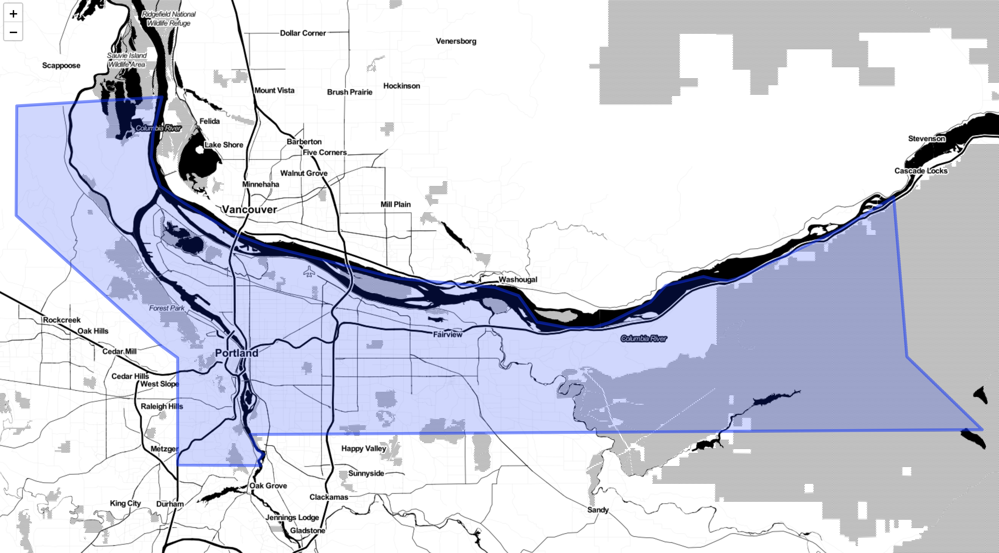

geojsonpolys
============


[](https://travis-ci.org/ropenscilabs/geojsonpolys)

`geojsonpolys` has GeoJSON polygons of political boundaries - GeoJSON you some data for greater good

it haz no dependenciez

data from <http://eric.clst.org/tech/usgeojson/>

## Installation

Dev version


```r
devtools::install_github("ropenscilabs/geojsonpolys")
```


```r
library("geojsonpolys")
```

## Get you some geojson

There's two datasets in the package so far. 

One `counties_us` is a character vector of GeoJSON for each county in the US. For example:


```r
counties_us[1]
#> [1] "{\"type\":\"Feature\",\"properties\":{\"GEO_ID\":\"0500000US01001\",\"STATE\":\"01\",\"COUNTY\":\"001\",\"NAME\":\"Autauga\",\"LSAD\":\"County\",\"CENSUSAREA\":594.436},\"geometry\":{\"type\":\"Polygon\",\"coordinates\":[[[-86.496774,32.344437],[-86.717897,32.402814],[-86.814912,32.340803],[-86.890581,32.502974],[-86.917595,32.664169],[-86.71339,32.661732],[-86.714219,32.705694],[-86.413116,32.707386],[-86.411172,32.409937],[-86.496774,32.344437]]]}}"
```

Another is a data.frame with the GeoJSON but also with metadata for states and counties, which
can make it easier to pick out the GeoJSON you want. (if you load `tibble` you get a brief data.frame 
output)


```r
library(tibble)
counties_us_df
#> # A tibble: 3,221 x 5
#>    state_code state   county_code county    geojson                       
#>    <chr>      <chr>   <chr>       <chr>     <chr>                         
#>  1 01         Alabama 001         Autauga   "{\"type\":\"Feature\",\"prop…
#>  2 01         Alabama 009         Blount    "{\"type\":\"Feature\",\"prop…
#>  3 01         Alabama 017         Chambers  "{\"type\":\"Feature\",\"prop…
#>  4 01         Alabama 021         Chilton   "{\"type\":\"Feature\",\"prop…
#>  5 01         Alabama 033         Colbert   "{\"type\":\"Feature\",\"prop…
#>  6 01         Alabama 045         Dale      "{\"type\":\"Feature\",\"prop…
#>  7 01         Alabama 051         Elmore    "{\"type\":\"Feature\",\"prop…
#>  8 01         Alabama 065         Hale      "{\"type\":\"Feature\",\"prop…
#>  9 01         Alabama 079         Lawrence  "{\"type\":\"Feature\",\"prop…
#> 10 01         Alabama 083         Limestone "{\"type\":\"Feature\",\"prop…
#> # ... with 3,211 more rows
```

## do something

Multnomah is a county in Oregon that contains Portland


```r
library(geojsonio)
geojsonio::map_leaf(multnomah)
```



## Meta

* Please [report any issues or bugs](https://github.com/ropenscilabs/geojsonpolys/issues).
* License: MIT
* Get citation information for `geojsonpolys` in R doing `citation(package = 'geojsonpolys')`
* Please note that this project is released with a [Contributor Code of Conduct](CODE_OF_CONDUCT.md).
By participating in this project you agree to abide by its terms.

[](https://ropensci.org)

